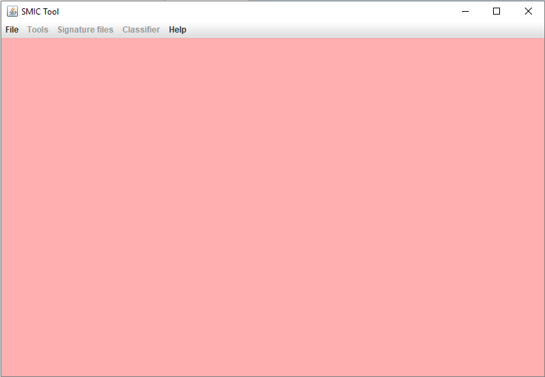
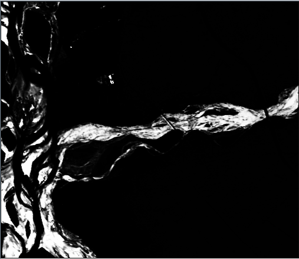
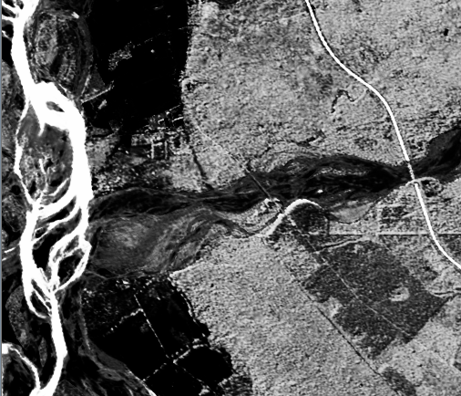
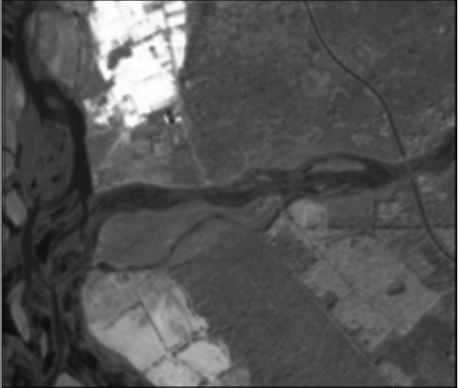
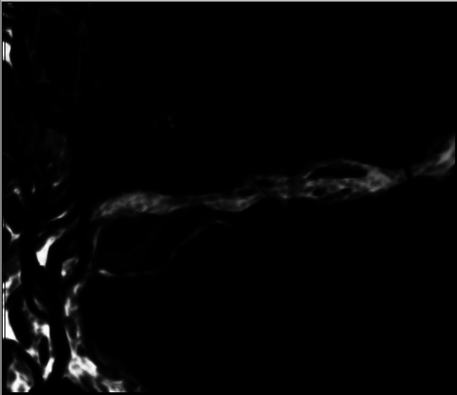
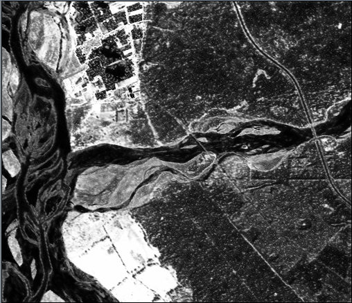

# SMIC
Development of SMIC  
SMIC stands for <em>Subpixel Multispectral Image Classifier.</em>

### Use of Local Information in Kernal based Fuzzy Classifier.

#### SMIC Tool

#### Fuzzy C-Mean Classifier Tool

#### Sample Image Display

##### Some Examples of image classification under some Fuzzy C-Mean Classifiers (Supervisied Classification)
###### Basic Classifiers
1. Kernal Fuzzy C-Means

|Clay| Grassland | Water | Wheat |
|:-------------------------:|:-------------------------:|:-------------------------:|:-------------------------:|
|   |   |   |   |

2. Kernal Possibilistic C-Means

|Clay| Grassland | Water | Wheat |
|:-------------------------:|:-------------------------:|:-------------------------:|:-------------------------:|
|   |    |   |  |

3. Kernal Modified Possibilistic C-Means S (KPCMS)

|Clay| Grassland | Water | Wheat |
|:-------------------------:|:-------------------------:|:-------------------------:|:-------------------------:|
|  ||||

4. Kernal Noise clustering without Entropy S

|Clay| Grassland | Water | Wheat | Noise |
|:-------------------------:|:-------------------------:|:-------------------------:|:-------------------------:|:-------------------------:|
||    |    |   | |

###### Advance Classifiers
1. Kernal PLICM

|Clay| Grassland | Water | Wheat |
|:-------------------------:|:-------------------------:|:-------------------------:|:-------------------------:|
|   |   |   |   |
